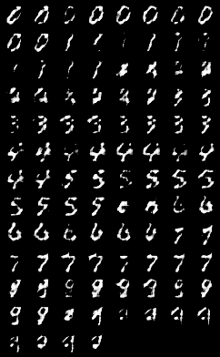

# NIS4307_Mnist_conditional_generator

基于数据集Mnist的手写体数字条件生成器。

## 文件目录

仓库包含两个目录：`release`和`training`。

`training`目录中：`cDCGAN.py`是神经网络的训练代码；`nets`文件下保存了训练得到的神经网络；`output`是训练过程中生成的图片以观察训练效果。

`release`目录中：接口类文件`aignmc.py`文件，其中定义了产生手写体数字的接口；`nets`是接口初始化神经网络时需要加载的生成器网络。

## 接口调用

首先引入模块`aigcmn.py`：

```python
from release.aigcmn import AiGcMn
```

而后实例化抽象类`AiGcMn`来初始化生成器，其需要一个参数`gen_path`来指定已训练好的神经网络模型，其位于`/release/nets/generator.pth`：

```python
aigcmn = AiGcMn('./release/nets/generator.pth')
```

调用这个类的实例的成员函数`generate()`来生成手写体图片，其接受一个一维Tensor，大小为batch_size：

```python
gen_output = aigcmn.generate(labels)
```

其返回一个`batch_size*1*28*28`的Tensor，即batch_size个单通道的28*28的灰度图。可以将其保存在`/output`中：

```python
from torchvision.utils import save_image

# 保存tensor
gen_output_numpy = gen_output.detach().numpy()
gen_output_numpy.tofile('./output/tensor.csv', sep=',')
print("Saved csv file!")

# 保存图片
save_image(gen_output, 'output/output.png')
print("Successfully saved output.")
```

完整示例代码可见：[此处](./example.py)。

## 训练效果

20次训练的训练过程。

